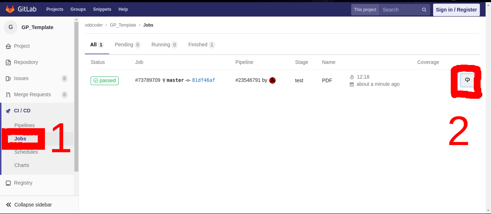

# My Graduation Project Thesis template

## why would you use it ?

The editor (person who is responsible in editing text) will not have to work
with Latex, instead he will be dealing with markdown files just like this
read-me.

## But why bother, google docs is there.

quoted from stack exchange:
> One of the advantages of LaTeX over other more traditional systems is the high
> typographical quality of the documents that you'll be able to produce. This is
> particularly true for documents that are heavy on mathematics, but documents
> for any other area could also take advantage of these qualities.

> A less obvious advantage, but much more important, is that LaTeX allows you to
> clearly separate the content from the format of your document. As a writer
> (scientist, researcher or not), this gives you the opportunity to focus on the
> “what”, the creative part of your work, rather than the “how” is it going to look
> printed out in paper (that is the work of LaTeX document class designers).

> LaTeX is intended to focus on document structure rather than appearance. Of course,
> some set up is needed to get the correct appearance, but once it is done most of the
> source you write is focused on structure. For example, there are commands such as
> \section for document structure rather than making everything bold, italic or
> whatever. This structured approach helps when you want to do things that are repetitive,
> as the formatting is always taken care of 'behind the scenes'.

## So I am going to type latex?

No, that is where this template goes in :). you type Markdown and let the magic happens
Mark down will get converted to latex and then to PDF generating a beautiful looking
[PDF file](template.pdf).

## so that is about latex, now why would I use Markdown instead ?

To create simple document with title in markdown it will look like this:

```md
# This is the title

And this is text
```

The minimal equivalent latex code will look like this

```tex
\documentclass{article}
    \usepackage[margin=0.7in]{geometry}
    \usepackage[parfill]{parskip}
    \usepackage[utf8]{inputenc}
    \usepackage{amsmath,amssymb,amsfonts,amsthm}
\begin{document}

\title{This is the title}

And this is text.

\end{document}
```
The moral of the story is that markdown is orders of magnitude easier than latex. 
One can practically learn it in less 10 minutes. But make no mistake, Markdown
is not as powerful as latex. This is where this template comes into play, It
make use of `pandoc` software and convert the markdown text to latex text than
apply some lengthy template and sprinkle some magic dust.

Out of the box, you will also get the following done automatically:
- Formatting text and editing fonts.
- Code coloring for almost every language you can use.
- Page numbering.
- Chapters numbering
- Bibliography(references) handling/numbering.
- Generating Table of contents.
- Figures numbering handling.
- Text reflowig.

Plus if you know latex, you can edit the tex template and add more to it :)

if you don't, you can completely avoid latex, but it will be the best available option
when writing math equations (embdded inside the markdown), other options is to
use mathjax.

## So how can I use it?

Just add some chapters to `chapters` folder, pictures to `pictures` folder.
If you got some references put it in `thesis.bib` file

## How is the project structured?

```
├── chapters			This folder holds all document sources
│   ├── 0100-title-page.md
│   ├── 0200-abstract.md
│   ├── 0300-abbreviations.md
│   ├── 0400-table-of-contents.md
│   ├── 0450-Introduction.md
│   └── 0500-ch2.md
├── LICENSE			Boring stuff,
├── Makefile			Used to do all the magic
├── pictures			Put all your pictures here
│   └── cat.jpg
├── README.md			This read me
├── template.tex		Need not to bother about this guy
├── thesis.bib			All references are placed here you can use tool like jabref to make your life easier
└─── .gitlab-ci.yml		CI file used to generate pdf when using gitlab
```

## How to get the pdf out?

On your typical linux machine you will need to install many packages

specifically texlive, pandoc, xelatex.

### Ubuntu

Never tested
```bash
root # apt-get update
root # apt-get install texlive-latex-base texlive-latex-extra texlive-xetex pandoc make zip
```

### Fedora

```bash
root # dnf -y update && dnf clean all
root # dnf -y install pandoc make zip texlive-collection-basic texlive-xetex
root # dnf -y install texlive-collection-latexrecommended texlive-collection-latex
root # dnf -y install texlive-collection-bibtexextra texlive-collection-latexextra
root # dnf -y install texlive-xetex-def texlive-collection-xetex
```
### Add you distro here :)

Here is me building the project on my own machine locally after installing all needed dependencies:
[](https://asciinema.org/a/enKBDkTHHnM3QEPK3DbrWgTBu)


The good news is that **you don't have to install anything locally**! Actually
you are encouraged not to.

You can clone the project from [gitlab](https://gitlab.com/oddcoder/GP_Template)
and it will generate the pdf to you on every edit the repo automatically :)




